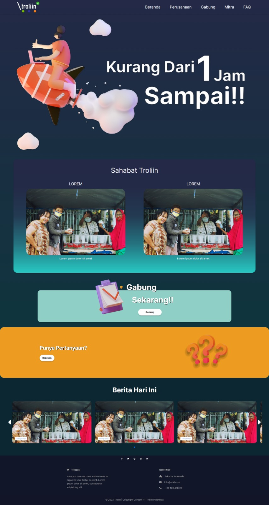
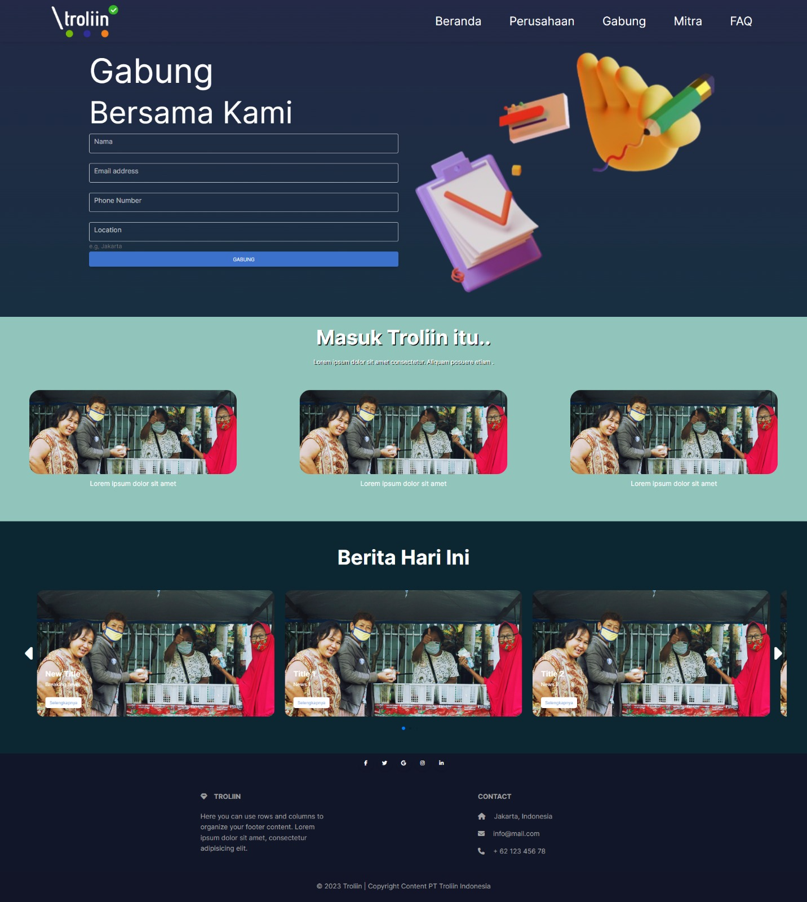
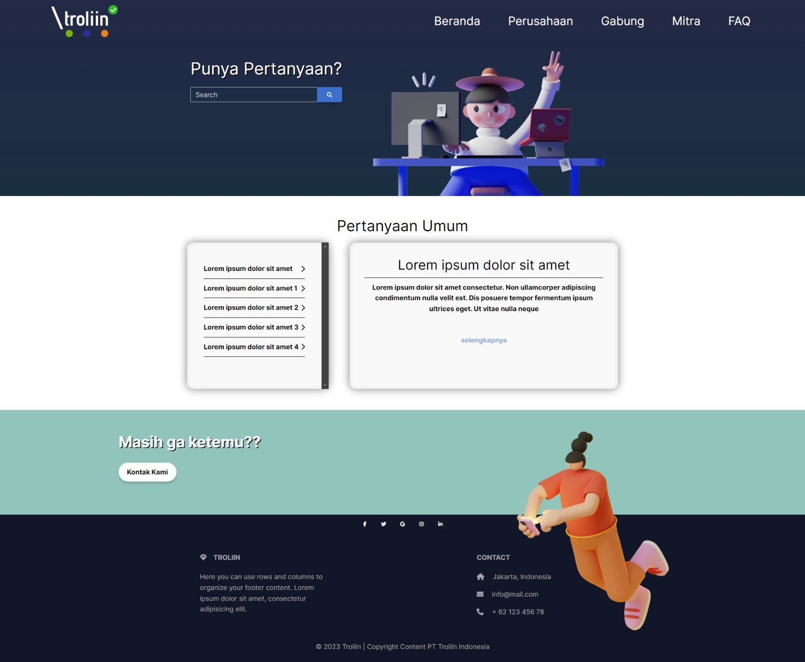
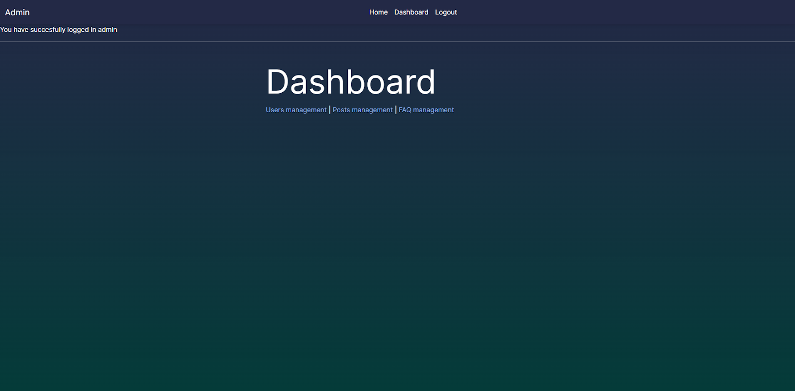
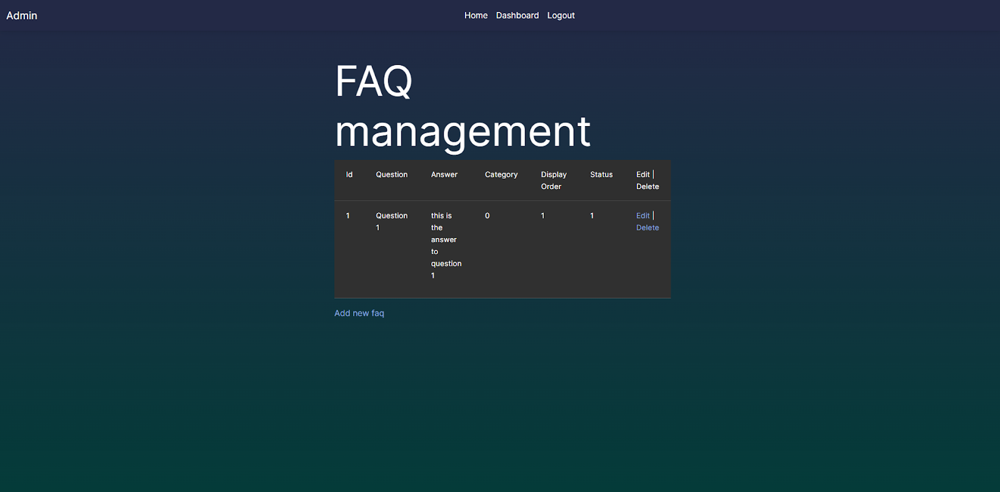
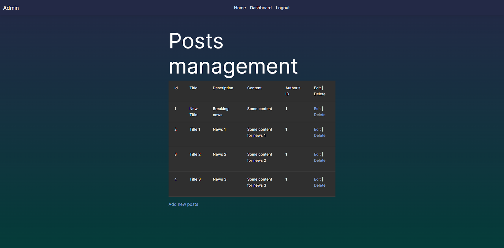
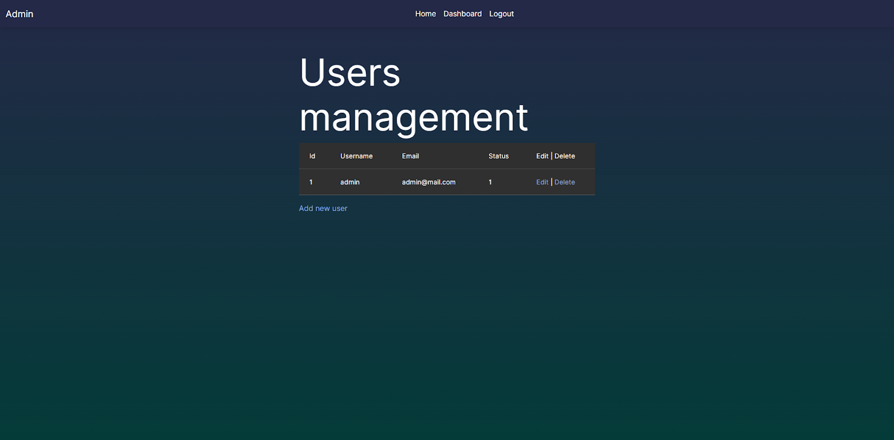

# Troliin-Web

Troliin is an e-commerce platform designed to simplify online shopping. It features a streamlined inventory management system, a secure shopping cart, and a user-friendly interface. The project was a deep dive into building a full-stack application, including database design, user authentication, and managing state across multiple components. this peoject uses php language and bootstrap 5.

----------------

Technologies Used
framework: bootstrap 5

Programming Language: PHP

Other Tools: Visual Studio Code, Git

------------

Screenshots

