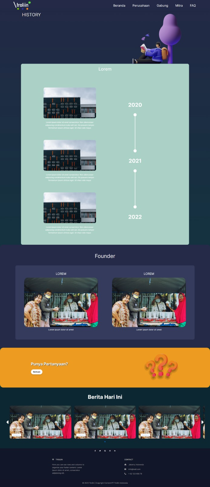

# 📝 Troliin Website
Project: "Proyek Pembuatan Landing page Troliin berbasis website" 💻 

An e-commerce platform for shopping carts and inventory management. This was a school assignment.

# 🌐 Project Overview
Troliin is an e-commerce platform designed to simplify online shopping. It features a streamlined inventory management system, a secure shopping cart, and a user-friendly interface. The project was a deep dive into building a full-stack application, including database design, user authentication, and managing state across multiple components. this peoject uses php language and bootstrap 5.

Project Status: The project is fully completed.

Why this project? This project was completed as part of a school assignment, which required us to secure a client and develop a website for them. The assignment's curriculum included all legal and procedural steps, such as drafting a proposal, maintaining a project journal, and executing a formal contract.

# 💻 Technologies Used
Markup Language: HTML5 (for semantic structure)

Styling: CSS3 (for responsive design and animations)

Scripting: PHP (for interactivity)

Framework: bootstrap 5

Version Control: Git & GitHub (for project management and collaboration)

Tools: Microsoft Word (for paperwork), VS Code, Figma (for initial design mockups), and a browser's developer tools.

# 🧑‍💻 Meet the Team
Andre Putra Samudera - Project Manager

Satria Nugraha P - Analyst

Fadillah Adam Yasir - Technical Writing

Claren clarichie - Design UI/UX

Zahran Rafi A (me) - Programmer

# 📸 Screenshots

  

---

  

---

  

---

  

---

  

---

  

